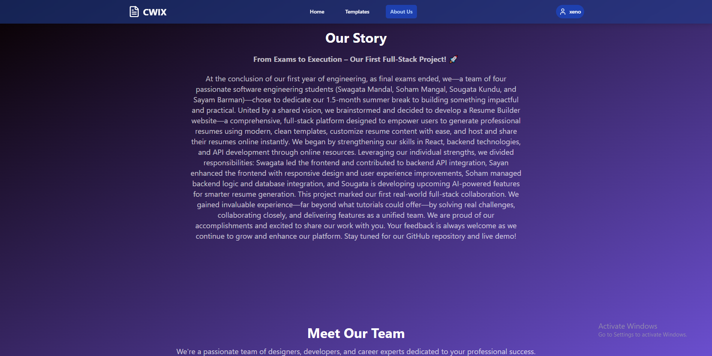

# 📄 Resume Maker

**Resume Maker** is a full-stack web application that allows users to seamlessly create, customize, and download professional resumes. Built using modern technologies like React and Node.js, this app aims to simplify resume building for users of all technical backgrounds.

---
## 🖼️ Screenshots




---
## 👥 Meet the Team

- **Swagata Mandal** – Lead Frontend Developer & Backend Contributor & API Integrator   
- **Sayam Barman** – Frontend Developer & UI/UX Enhancer  
- **Soham Mangal** – Lead Backend Developer 
- **Sougata Kundu** – AI Integration and Content Intelligence ( currently working on )

---
## 🚀 Features

- 🔐 **User Authentication** (Sign Up / Login)
- 📝 **Dynamic Resume Editor**
- 🎨 **Template Customization**
- 💾 **Downloadable PDF Support**
- 📦 Modular and scalable project structure

---

## 🛠️ Tech Stack

**Frontend**:
- React.js
- TypeScript
- Tailwind CSS
- Vite

**Backend**:
- Node.js
- Express.js
- MongoDB (via Mongoose)

**Tools & Libraries**:
- JWT for Authentication
- ESLint for code linting
- PDF generation utilities

---

## 📂 Project Structure

```
Resume-Maker/
├── backend/              # Backend API files
│   ├── config/          # Database config
│   ├── controllers/     # Route logic
│   ├── middleware/      # Validation/auth helpers
│   ├── models/          # Mongoose schemas
│   ├── routes/          # API endpoints
│   ├── Dockerfile       # Backend Docker configuration
│   ├── .dockerignore    # Docker ignore file
│   ├── .env.example     # Environment variables template
│   └── server.js        # Express server
├── frontend/            # Frontend application files
│   ├── public/          # Static files
│   ├── src/
│   │   ├── components/  # UI Components
│   │   ├── pages/       # Application pages
│   │   ├── services/    # API services
│   │   ├── context/     # React contexts
│   │   └── utils/       # Utility functions
│   ├── Dockerfile       # Frontend Docker configuration
│   ├── .dockerignore    # Docker ignore file
│   └── .env.example     # Environment variables template
├── TextEnhancerAI/      # AI text enhancement module
├── docker-compose.yml   # Docker services orchestration
├── mongo-init.js        # MongoDB initialization script
├── .gitattributes       # Git line ending configuration
└── README.md
```

---

## 🧪 Installation & Setup

### Option 1: Docker Setup (Recommended) 🐳

The easiest way to run the Resume Maker application is using Docker, which handles all dependencies including MongoDB automatically.

#### Prerequisites
- [Docker](https://docs.docker.com/get-docker/) installed on your system
- [Docker Compose](https://docs.docker.com/compose/install/) (usually included with Docker Desktop)

#### Quick Start with Docker

1. **Clone the repository**
   ```bash
   git clone https://github.com/Hacknova49/Resume-Maker.git
   cd Resume-Maker
   ```

2. **Set up environment variables (optional)**
   ```bash
   # Copy example environment files
   cp backend/.env.example backend/.env
   cp frontend/.env.example frontend/.env
   ```
   > The default configuration will work out of the box for development.

3. **Start the application**
   ```bash
   # Start all services (MongoDB, Backend, Frontend)
   docker-compose up
   
   # Or run in detached mode (background)
   docker-compose up -d
   ```

4. **Access the application**
   - **Frontend**: http://localhost:5173
   - **Backend API**: http://localhost:5000
   - **MongoDB**: localhost:27017

5. **Stop the application**
   ```bash
   # Stop all services
   docker-compose down
   
   # Stop and remove volumes (reset database)
   docker-compose down -v
   ```

#### Docker Commands Reference

```bash
# View running containers
docker-compose ps

# View logs for all services
docker-compose logs

# View logs for specific service
docker-compose logs frontend
docker-compose logs backend
docker-compose logs mongodb

# Rebuild containers after code changes
docker-compose build

# Restart specific service
docker-compose restart backend

# Execute commands in running container
docker-compose exec backend npm install new-package
docker-compose exec frontend npm install new-package
```

### Option 2: Manual Setup

If you prefer to run the application without Docker:

1. **Clone the repository**
   ```bash
   git clone https://github.com/Hacknova49/Resume-Maker.git
   cd Resume-Maker
   ```

2. **Install dependencies**
   ```bash
   # Install backend dependencies
   cd backend
   npm install
   
   # Install frontend dependencies
   cd ../frontend
   npm install
   ```

3. **Set up MongoDB**
   - Install MongoDB locally or use MongoDB Atlas
   - Create a `.env` file in the backend directory with your MongoDB URI

4. **Start the development servers**
   ```bash
   # Terminal 1: Start backend
   cd backend
   npm run dev
   
   # Terminal 2: Start frontend
   cd frontend
   npm run dev
   ```

> Note: For manual setup, make sure MongoDB is running locally or provide your MongoDB URI in a `.env` file for backend functionality.

---

## ⚠️ Known Issues

- PDF generation and layout may not always be pixel-perfect.
- Resume field validations can be improved.
- More templates and export formats coming soon!

---

## 🔧 Docker Troubleshooting

### Common Issues and Solutions

**Port already in use:**
```bash
# Check what's using the port
netstat -ano | findstr :5173
netstat -ano | findstr :5000
netstat -ano | findstr :27017

# Kill the process using the port (replace PID with actual process ID)
taskkill /PID <PID> /F
```

**Container won't start:**
```bash
# Check container logs
docker-compose logs <service-name>

# Rebuild containers
docker-compose build --no-cache
docker-compose up
```

**Database connection issues:**
```bash
# Reset database volume
docker-compose down -v
docker-compose up

# Check MongoDB container logs
docker-compose logs mongodb
```

**Frontend hot reload not working:**
- Make sure you're accessing the app via `http://localhost:5173`
- Try rebuilding the frontend container: `docker-compose build frontend`

**Permission issues on Linux/Mac:**
```bash
# Fix ownership of node_modules
sudo chown -R $(whoami) ./frontend/node_modules
sudo chown -R $(whoami) ./backend/node_modules
```

---

## 📌 To-Do / Roadmap

- [ ] Add more resume templates
- [ ] Rich text editing support
- [ ] Enhance Live preview while editing

---

## 🙌 Contributing

Pull requests are welcome! For major changes, please open an issue first to discuss your proposed change.

##Developers
Hacknova49

---

## 📄 License

This project is licensed under the MIT License.